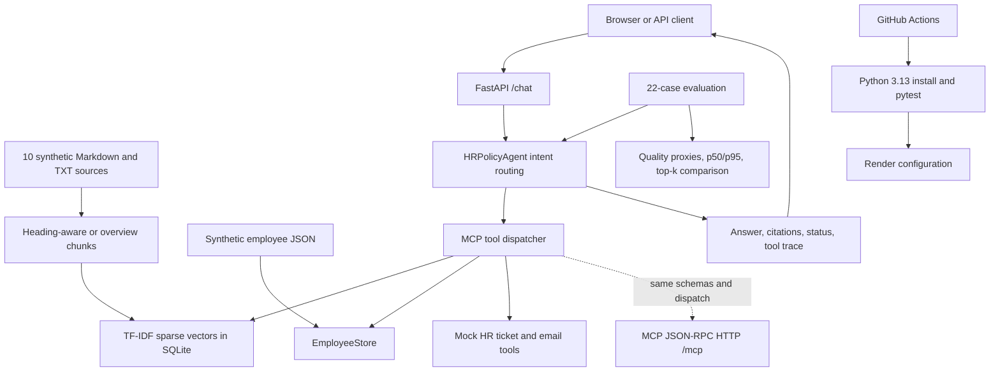

# Assignment Flow and Requirements Checklist

Status key: `[x]` implemented and locally verified; `[~]` partially implemented or evidence is incomplete; `[ ]` not yet satisfied.

## End-to-End Flow

The solid path is the current local request path. `/mcp` separately exposes initialization, discovery, and tool calls over stateless HTTP; the in-process agent uses the same named dispatcher and tool schemas rather than making an HTTP round trip to itself.

## Checklist

### 1. Environment and Reproducibility
- [x] Dependencies are declared in `requirements.txt`; Python 3.13 is used by the container and CI.
- [x] `README.md` documents local setup, run, deployment configuration, and evaluation commands.
- [x] Retrieval ordering is deterministic for a fixed corpus and query; no evaluation sampling is used.
- [x] Secrets are read from environment variables and `.env` is excluded from Git.
- [~] A local virtual environment is available in the development workspace, but it is not part of the repository; users create it from the documented commands.

### 2. Policy Corpus Ingestion and Indexing
- [x] Ten synthetic Markdown/TXT policy files contain approximately 11,459 words, or about 46 standard 250-word pages, within the requested 5-20 files and approximate 30-120 page range.
- [x] Markdown headings are used as section-aware chunks; section metadata and citation snippets are returned.
- [x] Plain-text TXT sources are ingested as overview chunks in addition to Markdown.
- [~] Deterministic corpus-fitted TF-IDF sparse vectors are persisted with chunk metadata in SQLite. This is a modest local vector baseline, not a pretrained semantic embedding model.
- [x] The corpus covers PTO, holidays, remote work, expenses, data security, benefits, onboarding, equipment, leave, and respectful workplace conduct.

### 3. Retrieval-Augmented Generation
- [x] Top-k policy retrieval and source snippets are included in `/chat` responses.
- [~] Answers include retrieved policy text as a clearly labeled basis and escalate on empty retrieval, but workflow summaries remain rule-based templates rather than a general grounded language-model synthesis.
- [~] There are out-of-scope and ambiguity responses, but they are keyword-based and do not consistently refuse when retrieval evidence is empty or weak.
- [~] The benchmark includes multi-policy questions, but multi-document evidence use is not independently enforced or scored.

### 4. Agentic System Design
- [x] The agent selects named policy and employee tools for remote-work, PTO, benefits, and mock communication workflows.
- [~] Tool selection is deterministic rule-based routing; it is not a general intent planner, and some employee IDs and answer details are fixed in code.
- [x] `/chat` returns operational tool names, arguments, results, citations, and status; this is an architectural trace, not hidden chain-of-thought.
- [~] Missing employees return tool errors, and drafts/tickets are mock-only; clarification and escalation handling is limited.
- [x] No real HR record is changed and no email is sent.

### 5. MCP Server and Tool Integration
- [x] Eight named tools are exposed, including policy search and structured employee lookup.
- [x] `/mcp` implements stateless JSON-RPC initialization, tool discovery, and tool calls over HTTP using the same dispatcher used by the agent.
- [x] Tests exercise MCP initialization, discovery, and an employee lookup call.
- [~] The integration is a small in-repo protocol implementation; interoperability with an independent MCP SDK/client has not yet been verified.
- [x] Tool schemas are returned by discovery, and mock actions remain non-production.

### 6. Web Application
- [x] FastAPI provides `/chat`, `/health`, `/evaluate`, and `/demo-tasks` plus a browser chat UI.
- [x] `/health` reports app and tool-server status; the chat response contains answer, citations, status, and tool trace.
- [x] Two reproducible demo tasks are exposed for remote work eligibility and PTO guidance.
- [~] The demo prompts are available through the API endpoint and README, not as dedicated UI controls.

### 7. Deployment
- [x] A free-tier single-service Render configuration and Dockerfile are present.
- [ ] A deployed, accessible shareable URL has not been verified or recorded. Deployment requires access to the user's hosting account.
- [ ] Cold-start behavior has not been measured or documented from a live hosted service.

### 8. CI/CD
- [x] GitHub Actions installs requirements and runs pytest on pushes and pull requests using Python 3.13.
- [x] Tests verify app health/startup through FastAPI's test client and exercise MCP tool discovery/calling.
- [~] CI does not automatically deploy; deployment is not configured as a post-test workflow.

### 9. Agent Evaluation
- [x] The evaluation set has 22 cases with categories and expected answer keywords/tools.
- [~] `/evaluate` reports keyword groundedness, source-section citation validity, expected-tool overlap, workflow completion, and safety pass rate. These are proxy metrics; cases include gold keywords rather than complete reference answers or human-judged labels.
- [x] Runtime reports measured p50/p95 for the current in-process benchmark run.
- [~] Retrieval comparison reports expected-keyword coverage for `k=1`, `3`, and `5`; the comparison is a lightweight ablation, not a statistically repeated experiment.
- [ ] Cold-start versus warm-start latency has not been reported.

#### Local Benchmark Snapshot

Run from the configured Python 3.13 environment on 2026-10-05; rerun `/evaluate` for current measurements. Latency is warm in-process agent handling after app/index construction, not network or cold-start latency.

| Metric | Result |
| --- | ---: |
| Cases | 22 |
| Keyword groundedness proxy | 0.886 |
| Citation source-section accuracy | 0.955 |
| Expected-tool selection overlap | 0.909 |
| Multi-step workflow completion proxy | 0.955 |
| Safety pass proxy | 0.955 |
| Request latency p50 / p95 | 0.98 / 1.09 ms |

Retrieval expected-keyword coverage was 0.701 at `k=1`, 0.860 at `k=3`, and 0.871 at `k=5`. This supports `k=3` as a reasonable context-size/coverage tradeoff in this small test set, but does not establish statistically robust quality.

### 10. Design Documentation
- [x] The README describes the application components, demo tasks, and single-service deployment shape.
- [~] This document adds the flow and implementation traceability, but the design rationale for chunk sizing, retrieval choices, model/provider choices, and safety limitations needs expansion alongside the corpus/index work.

## Remaining Work to Reach Full Compliance

1. The target source count and approximate page volume are now met; validate page length in the final rendered format if a stricter pagination definition is required.
2. Assess whether a pretrained local/free semantic embedding model improves retrieval over the persisted TF-IDF baseline; record chunking and retrieval parameter choices.
3. Replace remaining fixed workflow answer templates with evidence-driven synthesis, add robust weak-evidence and missing-identity handling, and include complete gold answers for all evaluation cases.
4. Independently verify `/mcp` with an MCP SDK client, then document the exact transport and client-discovery sequence.
5. Deploy the service through the user's Render account, record its public URL, and capture cold/warm latency evidence.
6. Extend CI to deploy only after tests pass if automatic deployment is required.
